# OpenCode Bridge

[]()
[](https://nodejs.org/)
[](https://www.typescriptlang.org/)
[](https://www.gnu.org/licenses/gpl-3.0)

**[中文](README.md) | [English](README-en.md)**

---

> **OpenCode Bridge** is an enterprise-grade AI programming collaboration bridge service that seamlessly integrates OpenCode (AI coding assistant) with mainstream instant messaging platforms, enabling cross-platform, cross-device intelligent programming collaboration.

---

## 📱 Supported Platforms

### Platform Overview

| Platform | Status | Login Method |
|----------|--------|--------------|
| Feishu (Lark) | ✅ Full Support | Bot Application |
| Discord | ✅ Full Support | Bot Token |
| WeCom (Enterprise WeChat) | ✅ Full Support | Bot Application |
| Telegram | ✅ Full Support | Bot Token |
| QQ (OneBot) | ✅ Full Support | OneBot Protocol |
| WhatsApp | ✅ Full Support | Phone Number Pairing |
| WeChat (Personal) | ✅ Full Support | QR Code Login |
| DingTalk | ✅ Full Support | Bot Application |

### Feature Comparison

| Feature | Feishu | Discord | WeCom | Telegram | QQ | WhatsApp | WeChat | DingTalk |
|---------|:------:|:-------:|:-----:|:--------:|:--:|:--------:|:------:|:--------:|
| Text Message | ✅ | ✅ | ✅ | ✅ | ✅ | ✅ | ✅ | ✅ |
| Rich Media/Card | ✅ | ✅ | ❌ | ✅ | ❌ | ❌ | ❌ | ✅ |
| Streaming Output | ✅ | ✅ | ✅ | ✅ | ✅ | ✅ | ✅ | ✅ |
| Permission Interaction | ✅ | ✅ | ✅ | ✅ | ✅ | ✅ | ✅ | ✅ |
| File Transfer | ✅ | ✅ | ✅ | ✅ | ❌ | ✅ | ✅ | ✅ |
| Group Chat | ✅ | ✅ | ✅ | ✅ | ✅ | ✅ | ✅ | ✅ |
| Private Chat | ✅ | ✅ | ✅ | ✅ | ✅ | ✅ | ✅ | ✅ |
| Message Recall | ✅ | ✅ | ❌ | ❌ | ❌ | ❌ | ❌ | ✅ |

---

## ✨ Key Features

### 🔄 Smart Session Management
- **Independent Session Binding**: Each group/private chat binds to an independent OpenCode session with isolated context
- **Session Migration**: Support session binding, migration, and renaming with context preserved across devices
- **Multi-Project Support**: Multiple project directory switching with alias configuration
- **Auto Cleanup**: Automatic cleanup of invalid sessions to prevent resource leaks

### 🤖 AI Interaction Capabilities
- **Streaming Output**: Real-time AI response display with thinking chain support
- **Permission Interaction**: AI permission requests confirmed within the chat platform
- **Question Answering**: AI questions answered within the chat platform
- **File Transfer**: AI can send files/screenshots to the chat platform
- **Shell Passthrough**: Whitelisted commands can be executed directly in chat

### 🛡️ Reliability Assurance
- **Heartbeat Monitoring**: Periodic OpenCode health probing
- **Auto Rescue**: Automatic restart and recovery when OpenCode crashes
- **Cron Tasks**: Runtime dynamic management of scheduled tasks
- **Log Auditing**: Complete operation logs and error tracking

### 🎛️ Web Management Panel
- **Visual Configuration**: Real-time modification of all configuration parameters in browser
- **Platform Management**: View connection status of each platform
- **Cron Management**: Create, enable/disable, delete scheduled tasks
- **Service Control**: View service status and remote restart

---

## 🚀 Quick Start

### 1. Clone Repository

```bash
git clone https://github.com/HNGM-HP/opencode-bridge.git
cd opencode-bridge
```

### 2. One-Click Deployment

**Linux/macOS:**
```bash
chmod +x ./scripts/deploy.sh
./scripts/deploy.sh guide
```

**Windows PowerShell:**
```powershell
.\scripts\deploy.ps1 guide
```

This command will automatically:
- Detect and guide Node.js installation
- Detect and guide OpenCode installation
- Install project dependencies and compile
- Generate initial configuration file

### 3. Start Service

**Linux/macOS:**
```bash
./scripts/start.sh
```

**Windows PowerShell:**
```powershell
.\scripts\start.ps1
```

**Development Mode:**
```bash
npm run dev
```

### 4. Configure Platform

After service starts, access the Web configuration panel:

```
http://localhost:4098
```

You will be prompted to set an administrator password on first access.

---

## 📝 Command Reference

### Common Commands

The following commands are available on all platforms:

| Command | Description |
|---------|-------------|
| `/help` | View help |
| `/status` | View current status |
| `/panel` | Display control panel |
| `/model` | View current model |
| `/model <name>` | Switch model |
| `/models` | List all available models |
| `/agent` | View current agent |
| `/agent <name>` | Switch agent |
| `/agents` | List all available agents |
| `/effort` | View current reasoning effort |
| `/effort <level>` | Set reasoning effort |
| `/session new` | Start new topic |
| `/sessions` | List sessions |
| `/undo` | Undo last interaction |
| `/stop` | Stop current response |
| `/compact` | Compress context |
| `/rename <name>` | Rename session |
| `/project list` | List available projects |
| `/clear` | Reset conversation context |

### Feishu Exclusive Commands

| Command | Description |
|---------|-------------|
| `/send <path>` | Send file to group chat |
| `/cron ...` | Manage Cron tasks |
| `/commands` | Generate command list file |
| `/create_chat` | Show create group card in private chat |
| `!<shell-cmd>` | Passthrough Shell command (whitelist) |
| `//xxx` | Passthrough namespace command |

### Discord Exclusive Commands

| Command | Description |
|---------|-------------|
| `///session` | View bound session |
| `///new` | Create and bind new session |
| `///bind <sessionId>` | Bind existing session |
| `///undo` | Undo last round |
| `///compact` | Compress context |
| `///workdir` | Set working directory |
| `///cron ...` | Manage Cron tasks |

---

## 🏗️ Architecture Overview

### System Architecture Diagram

```mermaid
flowchart LR
    %% Style definitions
    classDef platform fill:#e1f5fe,stroke:#0288d1,stroke-width:2px,rx:8px
    classDef core fill:#fff3e0,stroke:#f57c00,stroke-width:2px,rx:8px
    classDef handler fill:#f3e5f5,stroke:#7b1fa2,stroke-width:2px,rx:8px
    classDef opencode fill:#e8f5e9,stroke:#388e3c,stroke-width:2px,rx:8px
    classDef external fill:#fce4ec,stroke:#c2185b,stroke-width:2px,rx:8px,stroke-dasharray:5 5

    subgraph PlatformLayer["📱 Platform Adapter Layer"]
        direction TB
        feishu["✈️ Feishu"]:::platform
        discord["🎮 Discord"]:::platform
        wecom["💼 WeCom"]:::platform
        telegram["📤 Telegram"]:::platform
        qq["🐧 QQ"]:::platform
        whatsapp["📞 WhatsApp"]:::platform
        weixin["💬 WeChat"]:::platform
        dingtalk["📌 DingTalk"]:::platform
    end

    subgraph CoreLayer["⚙️ Core Processing Layer"]
        direction TB
        router["🔀 Router Center<br/><b>RootRouter</b>"]:::core

        subgraph Handlers["Handler Modules"]
            direction LR
            permission["🔐 Permission Handler"]:::handler
            question["❓ Q&A Handler"]:::handler
            output["📤 Output Buffer"]:::handler
        end
    end

    subgraph IntegrationLayer["🔗 Integration Layer"]
        sdk["🔌 OpenCode SDK<br/><b>OpencodeClient</b>"]:::opencode
    end

    subgraph External["🌐 External Services"]
        opencode["🤖 OpenCode Service"]:::external
        cli["💻 OpenCode CLI"]:::external
    end

    %% Connections
    PlatformLayer --> router
    router --> Handlers
    Handlers --> sdk
    sdk --> opencode
    opencode -.-> cli
```



**Architecture Description:**

| Layer | Responsibility | Key Components |
|-------|----------------|----------------|
| 📱 Platform Adapter Layer | Receive messages from each platform, unified format conversion | 8 Platform Adapters |
| ⚙️ Core Processing Layer | Message routing, permission validation, business processing | RootRouter, Permission, Question, Output |
| 🔗 Integration Layer | Communicate with OpenCode, send/receive requests | OpencodeClient SDK |
| 🌐 External Services | Actual AI service and CLI tools | OpenCode Service, CLI |

---

## 📚 Documentation

### Core Documentation

| Document | Description |
|----------|-------------|
| [Architecture](assets/docs/architecture-en.md) | Project layered design and core module responsibilities |
| [Configuration](assets/docs/environment-en.md) | Complete configuration parameter reference |
| [Deployment](assets/docs/deployment-en.md) | Deployment, upgrade and systemd configuration |
| [Commands](assets/docs/commands-en.md) | Complete command list and usage |
| [Reliability](assets/docs/reliability-en.md) | Heartbeat, Cron and crash rescue configuration |
| [Troubleshooting](assets/docs/troubleshooting-en.md) | Common issues and solutions |

### Platform Configuration Documentation

| Document | Description |
|----------|-------------|
| [Feishu Config](assets/docs/feishu-config-en.md) | Feishu event subscription and permission configuration |
| [Discord Config](assets/docs/discord-config-en.md) | Discord bot configuration guide |
| [WeCom Config](assets/docs/wecom-config-en.md) | Enterprise WeChat bot configuration guide |
| [Telegram Config](assets/docs/telegram-config-en.md) | Telegram Bot configuration guide |
| [QQ Config](assets/docs/qq-config-en.md) | QQ Official/OneBot protocol configuration guide |
| [WhatsApp Config](assets/docs/whatsapp-config-en.md) | WhatsApp Personal/Business configuration guide |
| [WeChat Personal Config](assets/docs/weixin-config-en.md) | WeChat personal account configuration guide |
| [DingTalk Config](assets/docs/dingtalk-config-en.md) | DingTalk bot Stream mode configuration guide |

### Extended Documentation

| Document | Description |
|----------|-------------|
| [Agent Usage](assets/docs/agent-en.md) | Role configuration and custom Agent |
| [Implementation](assets/docs/implementation-en.md) | Key feature implementation details |
| [SDK API](assets/docs/sdk-api-en.md) | OpenCode SDK integration guide |
| [Workspace Guide](assets/docs/workspace-guide-en.md) | Working directory strategy and project configuration |
| [Rollout](assets/docs/rollout-en.md) | Router mode rollout and rollback |

---

## 📋 Requirements

- **Node.js**: >= 18.0.0
- **Operating System**: Linux / macOS / Windows
- **OpenCode**: Must be installed and running

---

## 🔧 Configuration

### Configuration Methods

| Method | Description |
|--------|-------------|
| Web Panel (Recommended) | Access `http://localhost:4098` for visual configuration |
| SQLite Database | Configuration stored in `data/config.db` |
| .env File | Only stores Admin panel startup parameters |

### Core Configuration Options

| Option | Default | Description |
|--------|---------|-------------|
| `FEISHU_ENABLED` | `false` | Enable Feishu adapter |
| `DISCORD_ENABLED` | `false` | Enable Discord adapter |
| `OPENCODE_HOST` | `localhost` | OpenCode host address |
| `OPENCODE_PORT` | `4096` | OpenCode port |
| `ADMIN_PORT` | `4098` | Web configuration panel port |

For complete configuration parameters, refer to the [Configuration Center Documentation](assets/docs/environment-en.md).

---

## 📄 License

This project is licensed under [GNU General Public License v3.0](LICENSE)

**GPL v3 means:**
- ✅ Free to use, modify and distribute
- ✅ Can be used for commercial purposes
- ✅ Must open source modified versions
- ✅ Must retain original author copyright
- ✅ Derivative works must use GPL v3 license

---

## 🌟 Contributing

If this project helps you, please give it a Star!

For issues or suggestions, feel free to submit an [Issue](https://github.com/HNGM-HP/opencode-bridge/issues) or [Pull Request](https://github.com/HNGM-HP/opencode-bridge/pulls).

---

## 📞 Support

- **GitHub Issues**: [Report Issues](https://github.com/HNGM-HP/opencode-bridge/issues)
- **Project Home**: [GitHub Repository](https://github.com/HNGM-HP/opencode-bridge)
