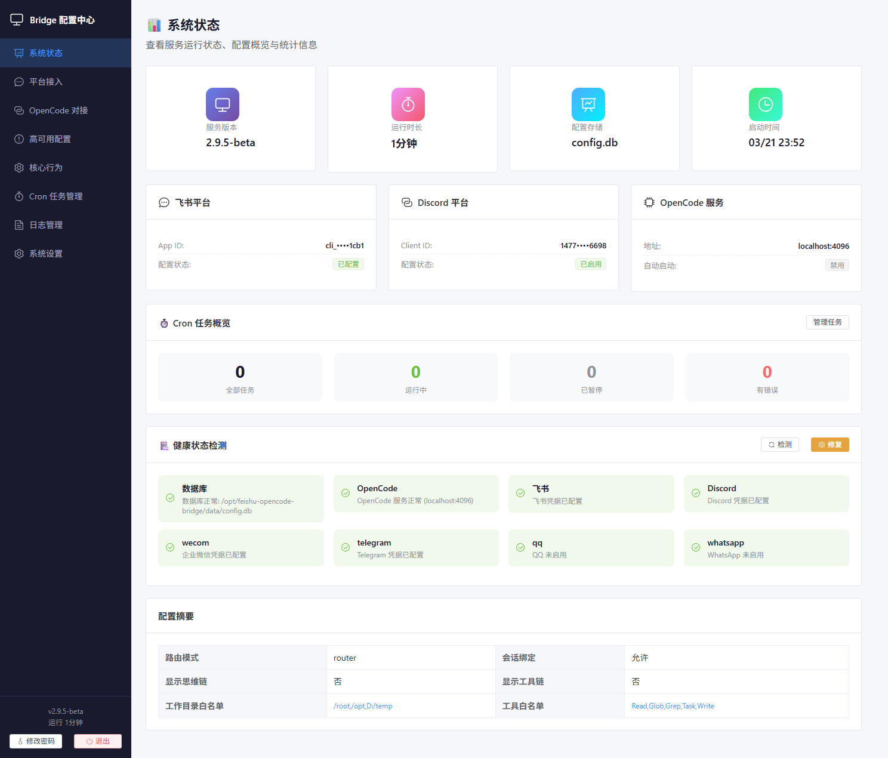
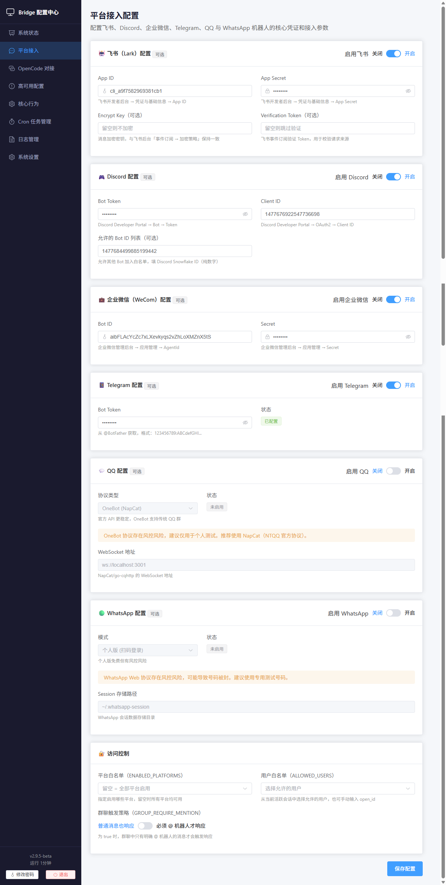
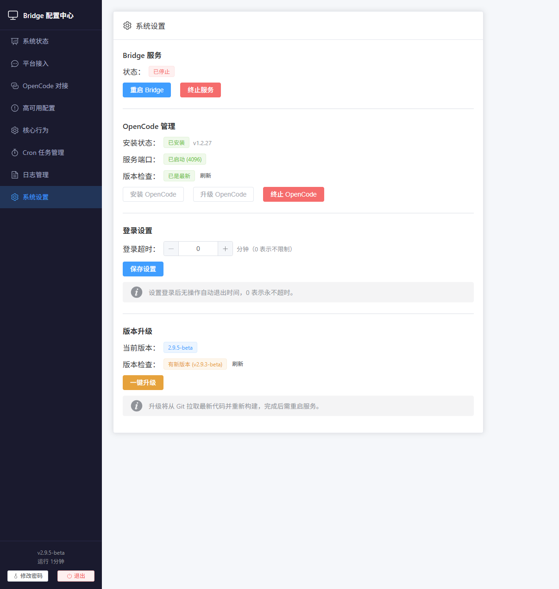

# OpenCode Bridge

[](https://github.com/HNGM-HP/opencode-bridge/blob/main)
[](https://nodejs.org/)
[](https://www.typescriptlang.org/)
[](https://www.gnu.org/licenses/gpl-3.0)

**[中文](./README.md) | [English](./README-en.md)**

---

**OpenCode Bridge** 是一款企业级 AI 编程协作桥接服务，将 OpenCode（AI 编程助手）无缝接入主流即时通讯平台，实现跨平台、跨设备的智能编程协作体验。

---

## 📱 支持平台

### 平台概览

| 平台 | 状态 | 接入方式 |
|------|------|----------|
| 飞书 (Lark) | ✅ 完整支持 | 机器人应用 |
| Discord | ✅ 完整支持 | Bot Token |
| 企业微信 (WeCom) | ✅ 完整支持 | 机器人应用 |
| Telegram | ✅ 完整支持 | Bot Token |
| QQ (OneBot) | ✅ 完整支持 | OneBot 协议 |
| WhatsApp | ✅ 完整支持 | 手机号配对 |
| 个人微信 | ✅ 完整支持 | 扫码登录 |
| 钉钉 (DingTalk) | ✅ 完整支持 | 机器人应用 |

### 功能支持对比

| 功能 | 飞书 | Discord | 企业微信 | Telegram | QQ | WhatsApp | 微信 | 钉钉 |
|------|------|---------|---------|---------|-----|---------|------|------|
| 文本消息 | ✅ | ✅ | ✅ | ✅ | ✅ | ✅ | ✅ | ✅ |
| 富媒体/卡片 | ✅ | ✅ | ❌ | ✅ | ❌ | ❌ | ❌ | ✅ |
| 流式输出 | ✅ | ✅ | ✅ | ✅ | ✅ | ✅ | ✅ | ✅ |
| 权限交互 | ✅ | ✅ | ✅ | ✅ | ✅ | ✅ | ✅ | ✅ |
| 文件传输 | ✅ | ✅ | ✅ | ✅ | ❌ | ✅ | ✅ | ✅ |
| 群聊支持 | ✅ | ✅ | ✅ | ✅ | ✅ | ✅ | ✅ | ✅ |
| 私聊支持 | ✅ | ✅ | ✅ | ✅ | ✅ | ✅ | ✅ | ✅ |
| 消息撤回 | ✅ | ✅ | ❌ | ✅ | ✅ | ✅ | ❌ | ✅ |

---

## ✨ 核心特性

### 🔄 智能会话管理

- **独立会话绑定**：每个群聊/私聊独立绑定 OpenCode 会话，上下文互不干扰
- **会话迁移**：支持会话绑定、迁移与重命名，跨设备接力无缝衔接
- **多项目支持**：支持多项目目录切换及项目别名配置
- **自动清理**：自动回收无效会话，防止资源泄漏

### 🤖 AI 交互能力

- **流式输出**：实时显示 AI 响应，支持思维链可视化
- **权限交互**：AI 权限请求直接在聊天平台内完成确认
- **问题回答**：AI 提问可在聊天平台内直接作答
- **文件传输**：AI 可将文件或截图主动发送至聊天平台
- **Shell 透传**：白名单命令可直接在聊天中执行

### 🛡️ 可靠性保障

- **心跳监控**：定时探测 OpenCode 健康状态，及时感知异常
- **自动救援**：OpenCode 宕机时自动重启恢复，无需人工干预
- **Cron 任务**：支持运行时动态管理定时任务
- **日志审计**：完整的操作日志与错误追踪记录

### 🎛️ Web 管理面板

- **可视化配置**：通过浏览器实时修改所有配置参数
- **平台管理**：查看各平台的连接状态
- **Cron 管理**：创建、启用/禁用及删除定时任务
- **服务控制**：查看服务运行状态，支持远程重启

---

<details>
<summary>🖼️ Web 可视化界面截图（点击展开）</summary>








</details>

---

## 🚀 快速开始

### 桌面应用（推荐）

Windows 和 macOS 用户可直接在 [GitHub Releases](https://github.com/HNGM-HP/opencode-bridge/releases) 下载对应安装包：

| 平台 | 安装包 | 说明 |
|------|--------|------|
| Windows | `.exe` | 双击安装，若提示"未识别应用"请选择"仍要运行" |
| macOS | `.dmg` | 拖拽至 Applications，首次启动请右键选择"打开" |

安装完成后启动应用，访问 `http://localhost:4098` 进行平台配置。

---

### 源码部署（Linux / 开发者）

#### 第一步：克隆项目

```bash
git clone https://github.com/HNGM-HP/opencode-bridge.git
cd opencode-bridge
```

#### 第二步：一键部署

**Linux / macOS：**

```bash
chmod +x ./scripts/deploy.sh
./scripts/deploy.sh
```

**Windows PowerShell：**

```powershell
.\scripts\deploy.ps1
```

部署脚本将自动完成以下操作：

- 检测并引导安装 Node.js
- 检测并引导安装 OpenCode
- 安装项目依赖并编译
- 生成初始配置文件

#### 第三步：启动服务

**Linux / macOS：**

```bash
./scripts/start.sh
```

**Windows PowerShell：**

```powershell
.\scripts\start.ps1
```

**开发模式：**

```bash
npm run dev
```

#### 第四步：配置平台

服务启动后，访问 Web 配置面板完成各平台接入配置：

```
http://localhost:4098
```

> 首次访问时系统将提示设置管理员密码。

---

## 📝 命令速查

### 通用命令（全平台可用）

| 命令 | 说明 |
|------|------|
| `/help` | 查看帮助 |
| `/status` | 查看当前状态 |
| `/panel` | 显示控制面板 |
| `/model` | 查看当前模型 |
| `/model <名称>` | 切换模型 |
| `/models` | 列出所有可用模型 |
| `/agent` | 查看当前角色 |
| `/agent <名称>` | 切换角色 |
| `/agents` | 列出所有可用角色 |
| `/effort` | 查看当前推理强度 |
| `/effort <档位>` | 设置推理强度 |
| `/session new` | 开启新话题 |
| `/sessions` | 列出会话 |
| `/undo` | 撤回上一轮交互 |
| `/stop` | 停止当前回答 |
| `/compact` | 压缩上下文 |
| `/rename <名称>` | 重命名会话 |
| `/project list` | 列出可用项目 |
| `/clear` | 重置对话上下文 |

### 飞书专属命令

| 命令 | 说明 |
|------|------|
| `/send <路径>` | 发送文件到群聊 |
| `/cron ...` | 管理 Cron 任务 |
| `/commands` | 生成命令清单文件 |
| `/create_chat` | 私聊中调出建群卡片 |
| `!<shell 命令>` | 透传 Shell 命令（白名单） |
| `//xxx` | 透传命名空间命令 |

### Discord 专属命令

| 命令 | 说明 |
|------|------|
| `///session` | 查看当前绑定的会话 |
| `///new` | 新建并绑定会话 |
| `///bind <sessionId>` | 绑定已有会话 |
| `///undo` | 撤回上一轮交互 |
| `///compact` | 压缩上下文 |
| `///workdir` | 设置工作目录 |
| `///cron ...` | 管理 Cron 任务 |

---

## 🏗️ 架构概览

```
┌─────────────────────────────────────────────────────┐
│                   📱 平台适配层                      │
│  飞书 | Discord | 企业微信 | Telegram | QQ |        │
│        WhatsApp | 微信 | 钉钉                        │
└──────────────────────┬──────────────────────────────┘
                       │ 统一消息格式
┌──────────────────────▼──────────────────────────────┐
│                   ⚙️ 核心处理层                      │
│        RootRouter → 权限处理 / 问题作答 / 输出缓冲  │
└──────────────────────┬──────────────────────────────┘
                       │
┌──────────────────────▼──────────────────────────────┐
│                   🔗 集成层                          │
│              OpencodeClient SDK                      │
└──────────────────────┬──────────────────────────────┘
                       │
┌──────────────────────▼──────────────────────────────┐
│                   🌐 外部服务                         │
│           OpenCode 服务 + OpenCode CLI               │
└─────────────────────────────────────────────────────┘
```

| 层级 | 职责 | 关键组件 |
|------|------|----------|
| 📱 平台适配层 | 接收各平台消息，统一格式转换 | 8 个平台适配器 |
| ⚙️ 核心处理层 | 消息路由、权限验证、业务处理 | RootRouter、Permission、Question、Output |
| 🔗 集成层 | 与 OpenCode 通信，收发请求 | OpencodeClient SDK |
| 🌐 外部服务 | 实际 AI 服务与命令行工具 | OpenCode 服务、CLI |

---

## 📚 文档导航

### 核心文档

| 文档 | 说明 |
|------|------|
| [架构设计](./assets/docs/architecture.md) | 项目分层设计与核心模块职责 |
| [配置中心](./assets/docs/environment.md) | 完整配置参数说明 |
| [部署运维](./assets/docs/deployment.md) | 部署、升级与 systemd 配置 |
| [命令速查](./assets/docs/commands.md) | 完整命令列表与使用说明 |
| [可靠性指南](./assets/docs/reliability.md) | 心跳、Cron 与宕机救援配置 |
| [故障排查](./assets/docs/troubleshooting.md) | 常见问题与解决方案 |

### 平台配置文档

| 文档 | 说明 |
|------|------|
| [飞书配置](./assets/docs/feishu-config.md) | 飞书事件订阅与权限配置 |
| [Discord 配置](./assets/docs/discord-config.md) | Discord 机器人配置指南 |
| [企业微信配置](./assets/docs/wecom-config.md) | 企业微信机器人配置指南 |
| [Telegram 配置](./assets/docs/telegram-config.md) | Telegram Bot 配置指南 |
| [QQ 配置](./assets/docs/qq-config.md) | QQ 官方 / OneBot 协议配置指南 |
| [WhatsApp 配置](./assets/docs/whatsapp-config.md) | WhatsApp Personal/Business 配置指南 |
| [微信个人号配置](./assets/docs/weixin-config.md) | 微信个人号配置指南 |
| [钉钉配置](./assets/docs/dingtalk-config.md) | 钉钉机器人 Stream 模式配置指南 |

### 扩展文档

| 文档 | 说明 |
|------|------|
| [Agent 使用](./assets/docs/agent.md) | 角色配置与自定义 Agent |
| [实现细节](./assets/docs/implementation.md) | 关键功能实现说明 |
| [SDK API](./assets/docs/sdk-api.md) | OpenCode SDK 集成指南 |
| [工作目录指南](./assets/docs/workspace-guide.md) | 工作目录策略与项目配置 |
| [灰度部署](./assets/docs/rollout.md) | 路由器模式灰度与回滚 |

---

## 📋 环境要求

| 依赖 | 版本要求 |
|------|----------|
| Node.js | >= 20.0.0 |
| 操作系统 | Linux / macOS / Windows |
| OpenCode | 需安装并运行 |

---

## 🔧 配置说明

### 配置管理方式

| 方式 | 说明 |
|------|------|
| Web 面板（推荐） | 访问 `http://localhost:4098` 进行可视化配置 |
| SQLite 数据库 | 配置存储于 `data/config.db` |
| `.env` 文件 | 仅存储 Admin 面板启动参数 |

### 核心配置项

| 配置项 | 默认值 | 说明 |
|--------|--------|------|
| `FEISHU_ENABLED` | `false` | 是否启用飞书适配器 |
| `DISCORD_ENABLED` | `false` | 是否启用 Discord 适配器 |
| `OPENCODE_HOST` | `localhost` | OpenCode 服务地址 |
| `OPENCODE_PORT` | `4096` | OpenCode 服务端口 |
| `ADMIN_PORT` | `4098` | Web 配置面板监听端口 |

完整配置参数请参考 [配置中心文档](./assets/docs/environment.md)。

---

## 📄 许可证

本项目采用 [GNU General Public License v3.0](./LICENSE)。

GPL v3 的核心要义：

- ✅ 可自由使用、修改和分发
- ✅ 可用于商业目的
- ✅ 修改版本必须开源
- ✅ 必须保留原作者版权声明
- ✅ 衍生作品须采用 GPL v3 协议

---

## 🌟 贡献与反馈

如果这个项目对你有帮助，欢迎点个 **Star** ⭐ 支持！

遇到问题或有改进建议，请提交 [Issue](https://github.com/HNGM-HP/opencode-bridge/issues) 或 [Pull Request](https://github.com/HNGM-HP/opencode-bridge/pulls)，期待你的参与。

---

## 📞 技术支持

- **GitHub Issues**：[问题反馈](https://github.com/HNGM-HP/opencode-bridge/issues)
- **项目主页**：[GitHub Repository](https://github.com/HNGM-HP/opencode-bridge)