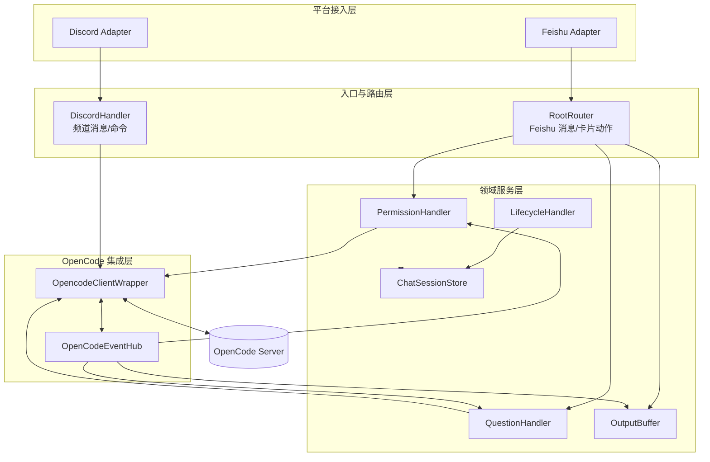
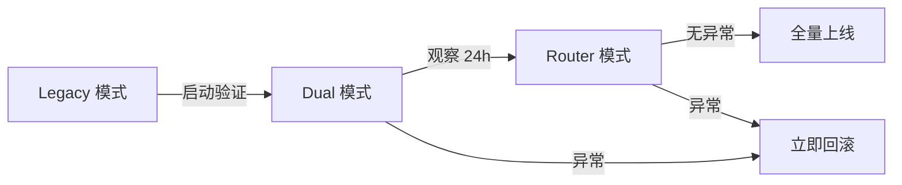

# 飞书 × OpenCode 桥接服务 v2.8.3-beta (Group)

[]()
[](https://nodejs.org/)
[](https://www.typescriptlang.org/)
[](https://www.gnu.org/licenses/gpl-3.0)


这不是“换个文案”的小版本，而是一次架构换代。`v2.8.3-beta` 将桥接核心从“单文件堆逻辑”重构为“平台适配层 + 根路由器 + OpenCode 事件中枢 + 领域处理器”的分层体系，重点解决跨平台扩展、权限闭环稳定性、目录实例一致性和线上可维护性。

<a id="先看痛点"></a>
## 🎯 先看痛点

- 权限和提问链路一旦断路，任务会卡住：`permission.asked` / `question.asked` 必须形成严格闭环。
- 多平台并行时最怕串线：会话绑定、权限队列、输出缓冲如果不按平台隔离，异常很难排查。
- 切目录后的实例一致性是高频坑：日志显示“允许”，实际 OpenCode 目录实例未命中，任务仍会挂起。
- 卡片与文本交互模型差异大：飞书与 Discord 不能硬复制同一交互范式，必须走平台原生能力。
- 运维闭环要求越来越高：仅靠“能跑起来”不够，必须可验证、可回滚、可灰度。

这个项目解决的不是“能不能回复消息”，而是“跨平台 AI 任务能否长期稳定闭环”。

<a id="与-openclaw-和同类桥接对比"></a>
## 🥊 与 OpenClaw 和同类桥接对比

> 结论：如果目标只是“在聊天里接一个 AI”，很多桥接都能满足；如果你要的是“权限/提问/会话/目录/回滚/运维”一体化工程链路，这个项目更适合生产化长期使用。

| 维度 | OpenClaw / 同类桥接常见形态 | 本项目（v2.8.3-beta） |
|---|---|---|
| 架构形态 | 消息通路优先，功能按需叠加 | 平台适配 + RootRouter + EventHub + Domain 分层 |
| 平台扩展 | 单平台能力迁移成本高 | Feishu / Discord 平台差异显式建模，能力独立演进 |
| 权限闭环 | 常见“提示后等待人工” | 白名单自动允许 + 失败降级入队 + 文本/卡片双通道确认 |
| 目录一致性 | 目录切换后状态易错位 | 权限响应目录感知，支持候选目录回退，降低假死概率 |
| 流式输出 | 多为单轨文本 | Timeline 统一聚合，支持 thinking/tool 可见性平台级开关 |
| 会话绑定 | 常见仅 chat->session 单向映射 | `platform:conversationId` 命名空间 + alias 回溯 |
| 运维能力 | 依赖脚本拼装 | 部署/升级/检查/后台/systemd 一体化入口 |

注：左列为常见实现归纳，不代表任一具体项目的完整能力清单；请以各项目当期版本文档为准。

新时代了，让 AI 代理自动部署吧：请在 OpenCode 执行如下指令：
```bash
请阅读 https://github.com/HNGM-HP/feishu-opencode-bridge/blob/main/AI_Deployment_Guide.md 文档并安装程序
```

## 📋 目录

- [先看痛点](#先看痛点)
- [与 OpenClaw 和同类桥接对比](#与-openclaw-和同类桥接对比)
- [为什么用它](#为什么用它)
- [能力总览](#能力总览)
- [效果演示](#效果演示)
- [架构概览](#架构概览)
- [快速开始](#快速开始)
- [部署与运维](#部署与运维)
- [环境变量](#环境变量)
- [飞书后台配置](#飞书后台配置)
- [命令速查](#命令速查)
- [关键实现细节](#关键实现细节)
- [故障排查](#故障排查)

<a id="为什么用它"></a>
## 💡为什么用它

- 对使用者友好：权限确认、question 作答、会话操作都在飞书里完成，不强依赖本地终端。
- 对协作友好：支持绑定已有会话与迁移绑定，跨设备、跨群接力时上下文不断裂。
- 对稳定性友好：会话映射持久化 + 双端撤回 + 同规则清理，避免“表面正常、状态错位”。
- 对运维友好：内置部署、升级、状态检查与后台管理流程，适合持续托管运行。
- 对未来版本友好：已兼容 OpenCode Server Basic Auth，服务端启用密码后仍可直接接入。

<a id="能力总览"></a>
## 📸 能力总览

| 能力 | 你能得到什么 | 相关命令/配置 |
|---|---|---|
| 群聊/私聊统一路由 | 同一套入口支持私聊和群聊，按映射路由到正确会话 | 群聊 @ 机器人；私聊直接发消息 |
| 私聊建群会话选择 | 建群时可选“新建会话/绑定已有会话”，提交时按选择生效 | `/create_chat`、`/建群` |
| 手动会话绑定 | 不中断旧上下文，直接把指定 session 接入当前群 | `/session <sessionId>`、`ENABLE_MANUAL_SESSION_BIND` |
| 迁移绑定与删除保护 | 绑定已有会话时自动迁移旧群映射，并保护会话不被误删 | 自动生效（手动绑定场景） |
| 生命周期清理兜底 | 启动清理与手动清理共用同一规则，降低误清理概率 | `/clear free session` |
| 权限卡片闭环 | OpenCode 权限请求在飞书内完成确认并回传结果 | `permission.asked` |
| question 卡片闭环 | OpenCode question 在飞书内回答/跳过并继续任务 | `question.asked` |
| 流式多卡防溢出 | 超过组件预算自动分页拆卡，旧页持续更新 | 流式卡片分页（预算 180） |
| 双端撤回一致性 | 撤回时同时回滚飞书消息与 OpenCode 会话状态 | `/undo` |
| 模型/角色/强度可视化控制 | 按会话切换模型、角色与推理强度，支持面板查看与命令操作 | `/panel`、`/model`、`/agent`、`/effort` |
| 上下文压缩 | 在飞书直接触发会话 summarize，释放上下文窗口 | `/compact` |
| Shell 命令透传 | 白名单 `!` 命令通过 OpenCode shell 执行并回显输出 | `!ls`、`!pwd`、`!git status` |
| 服务端鉴权兼容 | 支持 OpenCode Server Basic Auth，不怕后续默认强制密码 | `OPENCODE_SERVER_USERNAME`、`OPENCODE_SERVER_PASSWORD` |
| 文件发送到飞书 | AI 可将电脑上的文件/截图直接发送到当前飞书群聊 | `/send`、`发送文件` |
| 工作目录/项目管理 | 创建会话时指定工作目录，支持项目别名、群默认项目、9 阶段安全校验 | `/project list`、`/session new <别名>`、`ALLOWED_DIRECTORIES` |
| 部署运维闭环 | 提供部署/升级/检查/后台/systemd 的一体化入口 | `scripts/deploy.*`、`scripts/start.*` |

<a id="效果演示"></a>
## 🖼️ 效果演示

折叠展示图片，下面按场景整理：

<details>
<summary>Step 1：私聊独立会话（点击展开）</summary>

<p>
  
  
  
  
</p>

</details>

<details>
<summary>Step 2：多群聊独立会话（点击展开）</summary>

<p>
  
  
  
</p>

</details>

<details>
<summary>Step 3：图片附件解析（点击展开）</summary>

<p>
  
  
  
</p>

</details>

<details>
<summary>Step 4：交互工具测试（点击展开）</summary>

<p>
  
  
</p>

</details>

<details>
<summary>Step 5：底层权限测试（点击展开）</summary>

<p>
  
  
  
  
</p>

</details>

<details>
<summary>Step 6：会话清理（点击展开）</summary>

<p>
  
  
  
</p>

</details>

<a id="架构概览"></a>
## 📌 架构概览


- [项目架构](assets/docs/architecture.md)
- [OpenCode-sdk-api](assets/docs/sdk-api.md)

### 分层说明（v2.8.3-beta）

1. **平台接入层（Adapter）**
   - Feishu: 长连接事件 + 卡片交互，能力完整（权限/问题/流式卡片）。
   - Discord: 网关消息接入 + 文本回复 + 编辑/删除 + 会话命令，默认关闭按需启用。

2. **入口与路由层（Ingress）**
   - Feishu 走 `RootRouter`，维持既有权限卡片、问题卡片、双轨日志能力。
   - Discord 走 `DiscordHandler`，优先保证稳定问答闭环，不强行复制不适合 Discord 的卡片交互。

3. **领域服务层（Domain）**
   - `ChatSessionStore`: 统一会话命名空间（`platform:conversationId`），解决多平台同 ID 冲突。
   - `OutputBuffer`: 流式输出合并与节流，避免高频更新触发平台限流。
   - `PermissionHandler` / `QuestionHandler`: 管理 OpenCode 交互状态机与回路由。

4. **OpenCode 集成层**
   - `OpencodeClientWrapper`: 会话创建、消息发送、权限/问题回复、目录实例管理。
   - `OpenCodeEventHub`: 单监听入口，统一分发事件到缓冲区与交互处理器。

### 平台能力矩阵（当前实现）

| 能力 | Feishu | Discord | 设计取舍 |
|---|---|---|---|
| 消息接入（群/私聊） | ✅ | ✅ | 两端都支持 |
| 会话自动创建/绑定 | ✅ | ✅ | 统一走 `ChatSessionStore` |
| 群聊仅 @ 才响应 | ✅（`GROUP_REQUIRE_MENTION`） | ✅（同开关） | 降低噪声，兼容默认行为 |
| 流式更新 | ✅ | ✅ | 飞书卡片消息回复，Discord 文本回复 |
| 权限卡片闭环 | ✅ | ✅（Button/Select + 文本兜底） | Discord 原生组件交互，文本回复支持 allow/reject/always |
| question 卡片闭环 | ✅ | ✅（Select + 文本兜底） | 保持平台特性，不做硬复制 |
| 消息编辑/删除 | ✅ | ✅ | Discord Sender 已支持 |
### Discord 对齐策略（扬长避短）


- **优先落地**：消息稳定收发、会话绑定、@ 触发治理、可观测日志与可回滚配置。
- **利用优势**：Discord 文本链路低摩擦，先交付高可用问答与命令链路（`///session`、`///new`、`///clear`，并兼容旧前缀）。
- **避免短板硬上**：对 Discord 不天然友好的“飞书式卡片工作流”不做粗暴复制，后续按组件交互逐步演进。

<a id="快速开始"></a>
## 🚀 快速开始

### 1) 先执行这一条命令（首选）

Linux/macOS：

```bash
./scripts/deploy.sh guide
```

Windows PowerShell：

```powershell
.\scripts\deploy.ps1 guide
```

这条命令会自动完成：
- 检测 Node.js / npm（缺失时给安装引导）
- 检测 OpenCode 安装与端口状态
- 可一键安装 OpenCode（`npm i -g opencode-ai`）
- 安装项目依赖并编译桥接服务
- 若 `.env` 不存在，会自动由 `.env.example` 复制生成（不会覆盖已有 `.env`）
- 可在交互阶段直接输入 `FEISHU_APP_ID` / `FEISHU_APP_SECRET` 并写入 `.env`（支持回撤/跳过）

提醒：
- 不添加`guide`后缀执行命令为菜单。
- 这一条命令可以完成“部署与环境准备”。
- 但飞书密钥需要你自己填，脚本不会替你写入真实凭据；未填写时服务无法正常接收飞书消息。

### 2) 填写飞书配置（必须，若上一步已输入可跳过）

```bash
cp .env.example .env
```

至少填写：
- `FEISHU_APP_ID`
- `FEISHU_APP_SECRET`

### 3) 启动 OpenCode（保留 CLI 界面）

推荐在菜单里执行“启动 OpenCode CLI（自动写入 server 配置）”，或直接运行：

```bash
opencode
```

### 4) 启动桥接服务

Linux/macOS：

```bash
./scripts/start.sh
```

Windows PowerShell：

```powershell
.\scripts\start.ps1
```

开发调试可用：

```bash
npm run dev
```

<a id="部署与运维"></a>
## 💻 部署与运维

### 零门槛入口（推荐）

| 平台 | 管理菜单 | 一键部署 | 一键更新升级 | 启动后台 | 停止后台 |
|---|---|---|---|---|---|
| Linux/macOS | `./scripts/deploy.sh menu` | `./scripts/deploy.sh deploy` | `./scripts/deploy.sh upgrade` | `./scripts/start.sh` | `./scripts/stop.sh` |
| Windows PowerShell | `.\\scripts\\deploy.ps1 menu` | `.\\scripts\\deploy.ps1 deploy` | `.\\scripts\\deploy.ps1 upgrade` | `.\\scripts\\start.ps1` | `.\\scripts\\stop.ps1` |

说明：
- `deploy.sh`（Linux/macOS）和 `deploy.ps1`（Windows）会先自动检测 Node.js 与 npm。
- **Windows**：若未检测到 Node.js，会询问是否自动安装（优先使用 winget，其次 choco），安装后自动重试。
- **Linux/macOS**：若未检测到，会询问是否显示安装引导，再让用户确认是否重试检测。
- 菜单内已包含 OpenCode 的安装/检查/启动与首次引导，部署时会额外给出 OpenCode 安装与端口检查强提示（不阻断部署）。

### 已安装 Node 后可用命令

| 目标 | 命令 | 说明 |
|---|---|---|
| 一键部署 | `node scripts/deploy.mjs deploy` | 安装依赖并编译 |
| 一键更新升级 | `node scripts/deploy.mjs upgrade` | 先拆卸清理，再拉取并重新部署（保留升级脚本） |
| 安装/升级 OpenCode | `node scripts/deploy.mjs opencode-install` | 执行 `npm i -g opencode-ai` |
| 检查 OpenCode 环境 | `node scripts/deploy.mjs opencode-check` | 检查 opencode 命令与端口监听 |
| 启动 OpenCode CLI | `node scripts/deploy.mjs opencode-start` | 自动写入 `opencode.json` 后前台执行 `opencode` |
| 首次引导 | `node scripts/deploy.mjs guide` | 安装/部署/引导启动的一体化流程 |
| 管理菜单 | `node scripts/deploy.mjs menu` | 交互式菜单（默认入口） |
| 启动后台 | `node scripts/start.mjs` | 后台启动（自动检测/补构建） |
| 停止后台 | `node scripts/stop.mjs` | 按 PID 停止后台进程 |

### Linux 常驻（systemd）

管理菜单内提供以下操作：

- 安装并启动 systemd 服务
- 停止并禁用 systemd 服务
- 卸载 systemd 服务
- 查看运行状态

也可以直接命令行调用：

```bash
sudo node scripts/deploy.mjs service-install
sudo node scripts/deploy.mjs service-disable
sudo node scripts/deploy.mjs service-uninstall
node scripts/deploy.mjs status
```

日志默认在 `logs/service.log` 和 `logs/service.err`。

<a id="环境变量"></a>
## ⚙️ 环境变量

以 `src/config.ts` 实际读取为准：

| 变量 | 必填 | 默认值 | 说明 |
|---|---|---|---|
| `FEISHU_APP_ID` | 是 | - | 飞书应用 App ID |
| `FEISHU_APP_SECRET` | 是 | - | 飞书应用 App Secret |
| `ROUTER_MODE` | 否 | `legacy` | 路由模式：`legacy`/`dual`/`router` |
| `ENABLED_PLATFORMS` | 否 | - | 平台白名单，逗号分隔（如 `feishu,discord`） |
| `GROUP_REQUIRE_MENTION` | 否 | `false` | 为 `true` 时，群聊仅在明确 @ 机器人时响应 |
| `OPENCODE_HOST` | 否 | `localhost` | OpenCode 地址 |
| `OPENCODE_PORT` | 否 | `4096` | OpenCode 端口 |
| `DISCORD_ENABLED` | 否 | `false` | 是否启用 Discord 适配器 |
| `DISCORD_TOKEN` | 否 | - | Discord Bot Token（优先） |
| `DISCORD_BOT_TOKEN` | 否 | - | Discord Bot Token（兼容别名） |
| `DISCORD_CLIENT_ID` | 否 | - | Discord 应用 Client ID |
| `OPENCODE_SERVER_USERNAME` | 否 | `opencode` | OpenCode Server Basic Auth 用户名 |
| `OPENCODE_SERVER_PASSWORD` | 否 | - | OpenCode Server Basic Auth 密码 |
| `ALLOWED_USERS` | 否 | - | 飞书 open_id 白名单，逗号分隔；为空时不启用白名单 |
| `ENABLE_MANUAL_SESSION_BIND` | 否 | `true` | 是否允许“绑定已有 OpenCode 会话”；关闭后仅允许新建会话 |
| `DEFAULT_PROVIDER` | 否 | - | 默认模型提供商;与 `DEFAULT_MODEL` 同时配置才生效 |
| `DEFAULT_MODEL` | 否 | - | 默认模型;未配置时跟随 OpenCode 自身默认模型 |
| `TOOL_WHITELIST` | 否 | `Read,Glob,Grep,Task` | 自动放行权限标识列表 |
| `PERMISSION_REQUEST_TIMEOUT_MS` | 否 | `0` | 权限请求在桥接侧的保留时长（毫秒）；`<=0` 表示不超时，持续等待回复 |
| `OUTPUT_UPDATE_INTERVAL` | 否 | `3000` | 输出刷新间隔（ms） |
| `ATTACHMENT_MAX_SIZE` | 否 | `52428800` | 附件大小上限（字节） |
| `ALLOWED_DIRECTORIES` | 否 | - | 允许的工作目录根列表，逗号分隔绝对路径；未配置时禁止用户自定义路径，同时 `/send` 文件发送会直接拒绝 |
| `DEFAULT_WORK_DIRECTORY` | 否 | - | 全局默认工作目录（最低优先级兜底），不配置则跟随 OpenCode 服务端 |
| `PROJECT_ALIASES` | 否 | `{}` | 项目别名 JSON 映射（如 `{"fe":"/home/user/fe"}`），支持短名创建会话 |
| `GIT_ROOT_NORMALIZATION` | 否 | `true` | 是否自动将目录归一到 Git 仓库根目录 |
| `SHOW_THINKING_CHAIN` | 否 | `true` | 全局默认：是否显示 AI 思维链（thinking 内容） |
| `SHOW_TOOL_CHAIN` | 否 | `true` | 全局默认：是否显示工具调用链 |
| `FEISHU_SHOW_THINKING_CHAIN` | 否 | - | 飞书专用：覆盖全局 `SHOW_THINKING_CHAIN`，未设置时继承全局值 |
| `FEISHU_SHOW_TOOL_CHAIN` | 否 | - | 飞书专用：覆盖全局 `SHOW_TOOL_CHAIN`，未设置时继承全局值 |
| `DISCORD_SHOW_THINKING_CHAIN` | 否 | - | Discord 专用：覆盖全局 `SHOW_THINKING_CHAIN`，未设置时继承全局值 |
| `DISCORD_SHOW_TOOL_CHAIN` | 否 | - | Discord 专用：覆盖全局 `SHOW_TOOL_CHAIN`，未设置时继承全局值 |


注意：`TOOL_WHITELIST` 做字符串匹配，权限事件可能使用 `permission` 字段值（例如 `external_directory`），请按实际标识配置。

如果 OpenCode 端开启了 `OPENCODE_SERVER_PASSWORD`，桥接端也必须配置同一组 `OPENCODE_SERVER_USERNAME`/`OPENCODE_SERVER_PASSWORD`，否则会出现 401/403 认证失败。

模型默认策略:仅当 `DEFAULT_PROVIDER` 与 `DEFAULT_MODEL` 同时配置时，桥接才会显式指定模型;否则由 OpenCode 自身默认模型决定。

`ALLOWED_USERS` 说明：

- 未配置或留空：不启用白名单；生命周期清理仅在群成员数为 `0` 时才会自动解散群聊。
- 已配置：启用白名单保护；当群成员不足且群内/群主都不在白名单时，才会自动解散。

手动绑定会话说明（`ENABLE_MANUAL_SESSION_BIND=true` 时）：

- 通过 `/session <sessionId>` 或建群下拉卡片绑定已有会话后，会默认标记为“删除保护”。
- 自动清理与 `/clear free session` 仍可解散群聊并移除绑定，但会跳过 OpenCode `deleteSession`。

`ENABLE_MANUAL_SESSION_BIND` 取值语义：

- `true`：允许 `/session <sessionId>`，且建群卡片可选择“绑定已有会话”。
- `false`：禁用手动绑定能力；建群卡片仅保留“新建会话”。

`ALLOWED_DIRECTORIES` 说明：

- 未配置或留空：禁止用户通过 `/session new <path>` 自定义路径；仅允许使用默认目录、项目别名或从已知项目列表选择。
- 已配置：用户输入的路径经规范化与 realpath 解析后，必须落在允许根目录之下（含子目录），否则拒绝。
- 多个根目录用逗号分隔，如 `ALLOWED_DIRECTORIES=/home/user/projects,/opt/repos`。
- Windows 系统支持 Windows 格式路径，可使用正斜杠 `/` 或反斜杠 `\` 作为路径分隔符，如 `ALLOWED_DIRECTORIES=C:\Users\YourName\Documents,D:/Projects`。

`PROJECT_ALIASES` 说明：

- JSON 格式映射短名到绝对路径，如 `{"frontend":"/home/user/frontend"}`。
- 用户可通过 `/session new frontend` 使用别名创建会话，无需记忆完整路径。
- 别名路径同样受 `ALLOWED_DIRECTORIES` 约束。

### Discord 接入说明（v2.8.3-beta）

启用 Discord 需要同时满足：

1. `.env` 中开启 `DISCORD_ENABLED=true`
2. 配置 `DISCORD_TOKEN`（或 `DISCORD_BOT_TOKEN`）
3. 建议配置 `DISCORD_CLIENT_ID`
4. 在 Discord Developer Portal 中开启 **Message Content Intent**

推荐同时配置：

- `ENABLED_PLATFORMS=feishu,discord`（显式控制启用平台）
- `GROUP_REQUIRE_MENTION=true`（降低群聊噪声，只在明确 @ 机器人时响应）

当前 Discord 侧的可用能力：

- 频道/私聊消息接入与自动会话绑定
- 文本问答闭环（请求 OpenCode 后回帖）
- 流式输出展示：分隔符 + 思维链路代码块 + 最终答复正文
- OpenCode 会话命名：`Discord 私聊/群聊 <ID前6位> <频道ID前6位>`
- **权限交互闭环**：支持 Button/Select 组件交互，同时提供文本兜底（回复"允许/拒绝/始终允许"）
- question 交互闭环（显示题干 + 下拉作答 + 文本自定义答案 + 跳过本题）
- 机器人消息发送、回复、编辑、删除
- 会话频道创建：`///new-channel`（频道名 `opencode{sessionID前6位(去前缀)}`，权限不足自动回退当前频道绑定）
- 频道删除自动解绑：监听 `ChannelDelete` 自动清理本地会话映射
- 频道删除自动销毁会话：仅对 Discord 新建会话生效；外部绑定会话受保护不删除
- 未绑定自动建会话 onboarding：首次消息自动创建会话并发送帮助引导，同时提示`当前会话未与opencode绑定，已新建会话并绑定如需切换请按照help提示操作`
- 频道命令：`///session`、`///new`、`///new-channel`、`///bind`、`///unbind`、`///rename`、`///sessions`、`///workdir`、`///send`、`///clear`
- 下拉控制面板：`///create_chat`（同卡片多下拉：会话/模型/角色；强度使用命令行）

平台边界原则（不跨平台借调）：

- Discord 与 Feishu 是独立平台，各自保持原生交互范式
- Discord 侧不硬复制"飞书式卡片工作流"，而是利用 Discord 原生组件（Button/Select）逐步演进
- 两端会话体系独立，不支持跨平台会话借调或 UI 组件复用


## ⚙️ 飞书后台配置

建议使用长连接模式（WebSocket 事件）。

### 事件订阅（按代码已注册项）

| 事件 | 必需 | 用途 |
|---|---|---|
| `im.message.receive_v1` | 是 | 接收群聊/私聊消息 |
| `im.message.recalled_v1` | 是 | 用户撤回触发 `/undo` 回滚 |
| `im.chat.member.user.deleted_v1` | 是 | 成员退群后触发生命周期清理 |
| `im.chat.disbanded_v1` | 是 | 群解散后清理本地会话映射 |
| `card.action.trigger` | 是 | 处理控制面板、权限确认、提问卡片回调 |
| `im.message.message_read_v1` | 否 | 已读回执兼容（可不开启） |

### 应用权限（按实际调用接口梳理）

| 能力分组 | 代码中调用的接口 | 用途 |
|---|---|---|
| 消息读写与撤回（`im:message`） | `im:message.p2p_msg:readonly` / `im:message.group_at_msg:readonly` / `im:message.group_msg` / `im:message.reactions:read` / `im:message.reactions:write_only` | 发送文本/卡片、流式更新卡片、撤回消息 |
| 群与成员管理（`im:chat`） | `im:chat.members:read` / `im:chat.members:write_only` | 私聊建群、拉人进群、查群成员、自动清理无效群 |
| 消息资源下载（`im:resource`） | `im.messageResource.get` | 下载图片/文件附件并转发给 OpenCode |

注意：飞书后台不同版本的权限名称可能略有差异，按上表接口能力逐项对齐即可；若只需文本对话且不处理附件，可暂不开启 `im:resource`。
- 可以复制下方参数保存至acc.json，然后在飞书`开发者后台`--`权限管理`--`批量导入/导出权限`
```json
{
  "scopes": {
    "tenant": [
      "im:message.p2p_msg:readonly",
      "im:chat",
      "im:chat.members:read",
      "im:chat.members:write_only",
      "im:message",
      "im:message.group_at_msg:readonly",
      "im:message.group_msg",
      "im:message.reactions:read",
      "im:message.reactions:write_only",
      "im:resource"
    ],
    "user": []
  }
}
```

<a id="命令速查"></a>
## 📖 命令速查

| 命令 | 说明 |
|---|---|
| `/help` | 查看帮助 |
| `/panel` | 打开控制面板（模型、角色、强度状态、停止、撤回） |
| `/model` | 查看当前模型 |
| `/model <provider:model>` | 切换模型（支持 `provider/model`） |
| `/effort` | 查看当前会话推理强度与当前模型可选档位 |
| `/effort <档位>` | 设置会话默认强度（支持 `none/minimal/low/medium/high/max/xhigh`） |
| `/effort default` | 清除会话强度，回到模型默认策略 |
| `/fast` `/balanced` `/deep` | 强度快捷命令（分别映射 `low/high/xhigh`） |
| `/agent` | 查看当前 Agent |
| `/agent <name>` | 切换 Agent |
| `/agent off` | 关闭 Agent，回到默认 |
| `/role create <规格>` | 斜杠形式创建自定义角色 |
| `创建角色 名称=...; 描述=...; 类型=...; 工具=...` | 自然语言创建自定义角色并切换 |
| `/stop` | 中断当前会话执行 |
| `/undo` | 撤回上一轮交互（OpenCode + 飞书同步） |
| `/sessions` | 列出当前项目会话（含未绑定与仅本地映射记录） |
| `/sessions all` | 列出所有项目的全部会话 |
| `/session new` | 开启新话题（重置上下文，使用默认项目） |
| `/session new <项目别名或绝对路径>` | 在指定项目/目录中新建会话 |
| `/session new --name <名称>` | 创建会话时直接命名（如 `/session new --name 技术架构评审`） |
| `/rename <新名称>` | 随时重命名当前会话（如 `/rename Q3后端API设计讨论`） |
| `/project list` | 列出可用项目（别名 + 历史目录） |
| `/project default` | 查看当前群默认项目 |
| `/project default set <路径或别名>` | 设置当前群的默认工作项目 |
| `/project default clear` | 清除当前群默认项目 |
| `/session <sessionId>` | 手动绑定已有 OpenCode 会话（支持 Web 端创建的跨工作区会话；需启用 `ENABLE_MANUAL_SESSION_BIND`） |
| `新建会话窗口` | 自然语言触发新建会话（等价 `/session new`） |
| `/clear` | 等价于 `/session new` |
| `/clear free session` / `/clear_free_session` | 手动触发一次与启动清理同规则的兜底扫描 |
| `/clear free session <sessionId>` / `/clear_free_session <sessionId>` | 删除指定 OpenCode 会话，并移除所有本地绑定映射 |
| `/compact` | 调用 OpenCode summarize，压缩当前会话上下文 |
| `!<shell命令>` | 透传白名单 shell 命令（如 `!ls`、`!pwd`、`!mkdir`、`!git status`） |
| `/create_chat` / `/建群` | 私聊中调出建群卡片（下拉选择后点击"创建群聊"生效） |
| `/send <绝对路径>` | 发送指定路径的文件到当前群聊 |
| `/status` | 查看当前群绑定状态 |

Discord 侧推荐命令（优先 `///` 前缀，避免与原生 Slash 冲突）：
| 命令 | 说明 |
|---|---|
| `///session` | 查看当前频道绑定的 OpenCode 会话 |
| `///new [可选名称] [--dir 路径` / `别名]` | 新建并绑定会话 |
| `///new-channel [可选名称] [--dir 路径` / `别名]` | 新建会话频道并绑定 |
| `///bind <sessionId>` | 绑定已有会话 |
| `///unbind` | 仅解绑当前频道会话 |
| `///rename <新名称>` | 重命名当前会话 |
| `///sessions` | 查看最近可绑定会话 |
| `///effort` | 查看当前强度 |
| `///effort <档位>` | 设置会话默认强度（按当前模型能力校验） |
| `///effort default` | 清除会话强度 |
| `///workdir [路径 ` / `别名 ` / `clear]` | 设置/查看默认工作目录 |
| `///undo` | 回撤上一轮 |
| `///compact` / `///compat` | 压缩上下文 |
| `///send <绝对路径>` | 发送白名单文件到当前频道 |
| `发送文件 <绝对路径>` | `中文自然语言触发发送白名单文件 |
| `///clear` | 删除并解绑当前频道会话 |
| `///create_chat` | 打开下拉会话控制面板（查看状态/新建/绑定/模型/角色/回撤/压缩） |
| `///create_chat model <页码>` | 打开模型分页面板（总容量最多 500，单页 24） |
| `///create_chat session` / `agent` / `effort` | 打开分类面板 |

说明：

- 已保留兼容命令：`/session`、`/new`、`/new-session`、`/clear`。
- `///create_chat` 使用 Discord 下拉菜单与弹窗（Modal），用于补齐会话控制体验。
- `///clear` 在会话频道（topic 带 `oc-session:`）中会尝试直接删除频道；若权限不足则只解绑。

- `!` 透传仅支持白名单命令；`vi`/`vim`/`nano` 等交互式编辑器不会透传。
- 单条临时覆盖可在消息开头使用 `#low` / `#high` / `#max` / `#xhigh`（仅当前条生效）。
- 强度优先级：`#临时覆盖` > `///effort 会话默认` > 模型默认。
- `///sessions` 列表列顺序固定为：`工作区目录 | SessionID | OpenCode侧会话名称 | 绑定群明细 | 当前会话状态`。
- `///create_chat` 下拉标签顺序固定为：`工作区 / Session短ID / 简介`，并按工作区聚合展示。

<a id="Agent（角色）使用"></a>
## 🤖 Agent（角色）使用

### 1) 查看与切换

- 推荐使用 `/panel` 可视化切换角色（当前群即时生效）。
- 也可用命令：`/agent`（查看当前）、`/agent <name>`（切换）、`/agent off`（回到默认）。

### 2) 自定义 Agent

- 支持自然语言直接创建并切换：

```text
创建角色 名称=旅行助手; 描述=擅长制定旅行计划; 类型=主; 工具=webfetch; 提示词=先询问预算和时间，再给三套方案
```

- 也支持斜杠形式：

```text
/role create 名称=代码审查员; 描述=关注可维护性和安全; 类型=子; 工具=read,grep; 提示词=先列风险，再给最小改动建议
```

- `类型` 支持 `主/子`（或 `primary/subagent`）。

### 3) 配置 Agent（提醒）

- 配置后如果 `/panel` 未立即显示新角色，重启 OpenCode 即可。

<a id="关键实现细节"></a>
## 📌 关键实现细节

### 1) 权限请求回传

- `permission.asked` 里 `tool` 可能不是字符串工具名，实际白名单匹配可落在 `permission` 字段。
- 回传接口要求 `response` 为 `once | always | reject`，不是 `allow | deny`。

### 2) question 工具交互

- 问题渲染为飞书卡片，答案通过用户文字回复解析。
- 解析后按 OpenCode 需要的 `answers: string[][]` 回传，并纳入撤回历史。

### 3) 流式与思考卡片

- 文本与思考分流写入输出缓冲；出现思考内容时自动切换卡片模式。
- 卡片支持展开/折叠思考，最终态保留完成状态。

### 4) `/undo` 一致性

- 需要同时删除飞书侧消息并对 OpenCode 执行 `revert`。
- 问答场景可能涉及多条关联消息，使用递归回滚兜底。

### 5) 私聊建群卡片交互

- 下拉选择动作仅记录会话选择，不依赖卡片重绘；行为与 `/panel` 的下拉交互保持一致。
- 点击“创建群聊”时才执行建群与绑定，避免因卡片状态同步导致误绑定。

### 6) `/clear free session` 行为

- 该命令不做单独清理规则，而是复用生命周期扫描逻辑。
- 可在不重启进程时，手动触发一次“启动时清理”的同规则兜底扫描。

### 7) 文件发送到飞书

- `/send <绝对路径>` 直接调用飞书上传 API，不经过 AI，0 延迟。
- 图片（.png/.jpg/.gif/.webp 等）走图片通道（上限 10MB），其余走文件通道（上限 30MB），与飞书官方限制一致。
- 内置敏感文件黑名单（.env、id_rsa、.pem 等），防止误发。
- **安全策略**：仅允许发送位于 `ALLOWED_DIRECTORIES` 白名单范围内的文件；未配置 `ALLOWED_DIRECTORIES` 时，`/send` 默认拒绝。


### 8) 工作目录策略（DirectoryPolicy）

- 所有会话创建入口统一走 `DirectoryPolicy.resolve()` 9 阶段校验流水线。
- 校验顺序：优先级合并 → 格式校验 → 路径规范化 → 危险路径拦截 → 白名单校验 → 存在性预检 → realpath 解析 → Git 根目录归一化 → 归一后复检。
- 安全默认：未配置 `ALLOWED_DIRECTORIES` 时，用户不能自定义路径。
- 错误信息脱敏：用户侧只看到通用提示，完整路径仅写入服务端日志。
- 目录优先级：显式指定 > 项目别名 > 群默认 > 全局默认 > OpenCode 服务端默认。
## 🚀 灰度部署与回滚 SOP

> **注意**: 本章节适用于 v2.8.3-beta+ 版本，涉及路由器模式的灰度升级流程。如需详细操作指南，请参考 [`.sisyphus/evidence/task-16-fallback-recovery.txt`](.sisyphus/evidence/task-16-fallback-recovery.txt)。

### 1. 路由器模式配置

#### 1.1 模式说明

| 模式 | 说明 | 适用场景 | 风险等级 |
|------|------|----------|----------|
| `legacy` | 旧版直通路由 | 默认模式，稳定生产部署 | 🟢 低 |
| `dual` | 双轨模式（日志对比） | 灰度测试阶段，记录新旧路由对比 | 🟡 中 |
| `router` | 新版根路由器 | 验证通过后的全量模式 | 🟢 低 |

#### 1.2 配置方式

```bash
# 临时设置（命令行）
ROUTER_MODE=legacy node scripts/start.mjs
ROUTER_MODE=dual node scripts/start.mjs
ROUTER_MODE=router node scripts/start.mjs

# 永久设置（.env 文件）
echo "ROUTER_MODE=dual" >> .env
```

#### 1.3 启动日志示例

**Legacy 模式:**
```
[Config] 路由器模式: legacy
```

**Dual 模式:**
```
[Config] 路由器模式: dual
[Config] ⚠️ 双轨模式: 将记录新旧路由对比日志，不改变当前行为
[Config] 📝 如需回滚到旧版路由，设置 ROUTER_MODE=legacy 并重启服务
```

**Router 模式:**
```
[Config] 路由器模式: router
```

### 2. 灰度验收流程

#### 2.1 三阶段验收

遵严格的三阶段验证流程，确保回滚路径清晰可控：



**Phase 1: Legacy 验证**
- 配置: `ROUTER_MODE=legacy`
- 验证内容: 基础消息流、权限流、卡片流
- 通过标准: 53 个单元测试 100% 通过

**Phase 2: Dual 验证**
- 配置: `ROUTER_MODE=dual`
- 验证内容: 双轨日志对比、行为一致性
- 关键日志: `type: "[Router][dual]"` 字段完整性
- 观察时间: ≥ 24 小时

**Phase 3: Router 验证**
- 配置: `ROUTER_MODE=router`
- 验证内容: 新路由事件分发、功能等价性
- 通过标准: 与 legacy 模式行为一致

#### 2.2 验证套件

**功能验证:**
- [ ] 私聊消息收发
- [ ] 群聊消息收发
- [ ] 权限卡片确认
- [ ] 提问卡片处理
- [ ] 消息撤回同步
- [ ] 会话绑定迁移

**性能验证:**
- [ ] 消息延迟 < 500ms
- [ ] 错误率 < 0.1%
- [ ] 卡片.update成功率 > 99%

**日志验证:**
- [ ] 双轨日志字段完整
- [ ] 无异常错误输出

### 3. 回滚 SOP

#### 3.1 回滚触发条件

出现以下任一情况时，立即执行回滚：

| 触发条件 | 响应级别 | 说明 |
|----------|----------|------|
| 消息延迟 > 2s | P0 | 严重影响用户体验 |
| 错误率 > 5% | P0 | 系统异常率过高 |
| 权限卡/提问卡失效 | P0 | 功能严重降级 |
| 会话绑定失败率 > 10% | P1 | 影响多会话管理 |

#### 3.2 回滚步骤

```bash
# 1. 停止服务
node scripts/stop.mjs

# 2. 设置回滚模式
echo "ROUTER_MODE=legacy" > .env

# 3. 重启服务
node scripts/start.mjs

# 4. 验证回滚成功
grep "路由器模式" logs/service.log
# 期望输出: [Config] 路由器模式: legacy
```

#### 3.3 回滚后复测

回滚后必须验证：

- [ ] 普通消息收发正常
- [ ] 权限卡片正确显示
- [ ] 提问卡片正确处理
- [ ] 撤回操作同步
- [ ] 会话绑定功能正常

### 4. 日志诊断

#### 4.1 双轨日志格式（dual 模式）

```json
{
  "type": "[Router][dual]",
  "event": "onMessage",
  "platform": "feishu",
  "conversationKey": "feishu:chat_id_xxx",
  "sessionId": "session_id_xxx",
  "routeDecision": "group",
  "chatType": "group",
  "chatId": "chat_id_xxx"
}
```

**字段说明:**
- `conversationKey`: 会话键（格式: `{platform}:{chatId}`）
- `sessionId`: OpenCode 会话 ID
- `routeDecision`: 路由决策（p2p/group/card_action/opencode_event）

#### 4.2 关键日志命令

```bash
# 检查路由器模式
grep "路由器模式" logs/service.log

# 检查双轨日志（dual 模式）
grep "\[Router\]\[dual\]" logs/service.log

# 检查错误日志
tail -n 100 logs/service.err | grep -i error
```

### 5. 环境变量参考

| 变量 | 默认值 | 说明 |
|------|--------|------|
| `ROUTER_MODE` | `legacy` | 路由器模式: legacy \| dual \| router |
| `ENABLED_PLATFORMS` | * | 启用的平台列表（逗号分隔） |

**注意**: `ROUTER_MODE` 仅接受 `legacy`、`dual`、`router` 三个值，其他值将回退到 `legacy`。

### 6. 相关文档

| 文档路径 | 说明 |
|----------|------|
| `.sisyphus/evidence/task-16-rollout-gate.txt` | 三阶段验收证据 |
| `.sisyphus/evidence/task-16-fallback-recovery.txt` | 详细回滚 SOP |
| `src/config.ts` | 路由器模式配置实现 |
| `src/router/root-router.ts` | 根路由器实现 |

---

<a id="关键实现细节"></a>

## 🛠️ 故障排查

| 现象 | 优先检查 |
|---|---|
| 飞书发送消息后OpenCode无反应 | 仔细检查飞书权限；确认 [飞书后台配置](#飞书后台配置) 正确 |
| 点权限卡片后 OpenCode 无反应 | 日志是否出现权限回传失败；确认回传值是 `once/always/reject` |
| 权限卡或提问卡发不到群 | `.chat-sessions.json` 中 `sessionId -> chatId` 映射是否存在 |
| 卡片更新失败 | 消息类型是否匹配；失败后是否降级为重发卡片 |
| `/compact` 失败 | OpenCode 可用模型是否正常；必要时先 `/model <provider:model>` 再重试 |
| `!ls` 等 shell 命令失败 | 当前会话 Agent 是否可用；可先执行 `/agent general` 再重试 |
| 后台模式无法停止 | `logs/bridge.pid` 是否残留；使用 `node scripts/stop.mjs` 清理 |
| 私聊首次会推送多条引导消息 | 这是首次流程（建群卡片 + `/help` + `/panel`）；后续会按已绑定会话正常对话 |
| `/send <路径>` 报"文件不存在" | 确认路径正确且为绝对路径；Windows 路径用 `\` 或 `/` 均可 |
| `/send` 报"拒绝发送敏感文件" | 内置安全黑名单拦截了 .env、密钥等敏感文件 |
| 文件发送失败提示大小超限 | 飞书图片上限 10MB、文件上限 30MB；压缩后重试 |
| OpenCode 大于 `v1.2.15 `版本 通过飞书发消息无不响应 | 检查`~/.config/opencode/opencode.json（linux/mac为config.json）`是否有 ` "default_agent": "companion"`有请删除 |
<a id="许可证"></a>
## 📝 许可证

本项目采用 [GNU General Public License v3.0](LICENSE)

**GPL v3 意味着：**
- ✅ 可自由使用、修改和分发
- ✅ 可用于商业目的
- 📝 必须开源修改版本
- 📝 必须保留原作者版权
- 📝 衍生作品必须使用 GPL v3 协议

如果这个项目对你有帮助，请给个 ⭐️ Star！
