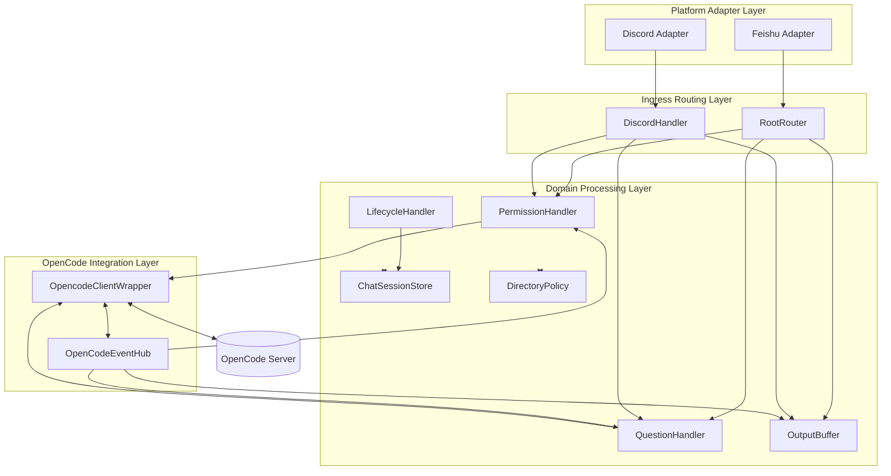

# Feishu × OpenCode Bridge Architecture (v2.9.2-beta-pr1)

This document describes the current running architecture, focusing on platform integration, routing scheduling, event closure, directory consistency, and maintainability strategies.

## 1. Architecture Goals

- Provide consistent task closure capabilities on both Feishu and Discord (messages, permissions, questions, streaming output, rollback).
- Maintain platform capability boundaries; do not forcibly reuse incompatible interaction paradigms.
- Ensure session and directory consistency, reducing the risk of "logs show success but tasks are stuck".
- Use a layered structure instead of entry-point stacking logic to support future platform expansion and gray evolution.

## 2. Layered Model

## 3. Core Module Responsibilities

### 3.1 Platform Adapter Layer

- `src/platform/adapters/feishu-adapter.ts`: Receives Feishu events and converts them to a unified event model.
- `src/platform/adapters/discord-adapter.ts`: Receives Discord gateway messages and component interactions.

### 3.2 Ingress Routing Layer

- `src/router/root-router.ts`: Unified entry point for Feishu messages and card actions.
- `src/handlers/discord.ts`: Discord commands, panels, text permissions/questions handling and message routing orchestration.
- `src/router/action-handlers.ts`: Decouples permission/question action callbacks from the entry point.

### 3.3 Domain Processing Layer

- `src/permissions/handler.ts`: Permission request queues, whitelist determination, dequeuing and timeout cleanup.
- `src/opencode/question-handler.ts`: Question state management (multi-question progression, skip, submission).
- `src/opencode/output-buffer.ts`: Streaming fragment aggregation, throttling triggers, state markers.
- `src/store/chat-session.ts`: `platform:conversationId` namespace mapping and session aliases.
- `src/utils/directory-policy.ts`: Directory security policies, whitelist constraints, Git root normalization.
- `src/handlers/lifecycle.ts`: Lifecycle scanning, cleanup and dismissal logic.

### 3.4 OpenCode Integration Layer

- `src/opencode/client.ts`: Unified encapsulation for sessions/messages/commands/permissions/questions.
- `src/router/opencode-event-hub.ts`: Single entry point for OpenCode events, distributed to permissions, questions, and output.

## 4. Key Workflows

### 4.1 Message Workflow (Inbound → OpenCode)

1. Platform adapter receives messages and normalizes them.
2. RootRouter/DiscordHandler completes command parsing and session location.
3. Assembles model, role, effort, and directory parameters based on session configuration.
4. Calls `opencodeClient.sendMessage*` to enter OpenCode.

### 4.2 Event Workflow (OpenCode → Outbound)

1. `opencodeClient` listens to the event stream.
2. `OpenCodeEventHub` processes `messagePartUpdated/sessionStatus/...`.
3. Timeline and OutputBuffer aggregate and throttle.
4. Feishu uses card streaming; Discord uses text/component updates.

### 4.3 Permission Closure Workflow

1. After receiving `permission.asked`, determine whitelist first.
2. If whitelist matches, automatically allow; if failed, downgrade to queue and wait for manual confirmation.
3. Manual confirmation supports both card actions and text fallback paths.
4. Permission response supports directory awareness and candidate directory fallback, reducing deadlocks after directory switches.

## 5. Directory Consistency Strategy

- Session creation/switching goes through unified directory policy validation.
- `create_chat` working directory sources are merged from three categories:
  - `DEFAULT_WORK_DIRECTORY`
  - `ALLOWED_DIRECTORIES`
  - Existing session directories (history/bound)
- Permission response carries directory candidate information, prioritizing the current session directory, then falling back to the candidate directory list.

## 6. Platform Boundary Principles

- Feishu and Discord are independent platforms:
  - Do not borrow UI components across platforms.
  - Do not reuse session display semantics across platforms.
- Common logic is pushed down to the domain layer (permissions, questions, session mapping, directory policies).
- Platform differences remain at the ingress layer and adapter layer (cards/components/text interactions).

## 7. Runtime and Troubleshooting Recommendations

- Check the router mode and platform enablement logs first, then check session mapping and permission queue status.
- For permission issues, prioritize checking: queue key, session binding, directory candidates.
- For card issues, prioritize checking: whether routing actions enter the corresponding handler, whether they are restricted by platform capabilities.
- After modifying core workflows, must run: `npm run build` + `npm test`.

## 8. Future Extension Points

- Add new platform adapters (only need to integrate with the unified event model and sender interface).
- Converge more cross-platform capabilities into action-handlers and event-hub.
- Continue to enhance directory instance self-healing capabilities and permission retry observability.
