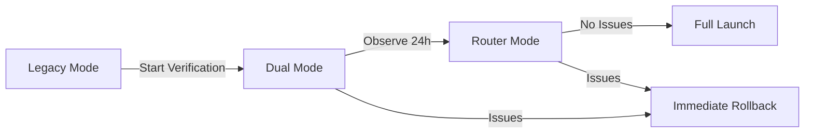

# Gray Deployment and Rollback SOP

> **Note**: This section applies to v2.9.1, involving router mode gray upgrade flow.

## 1. Router Mode Configuration

### 1.1 Mode Description

| Mode | Description | Use Case | Risk Level |
|------|------|----------|----------|
| `legacy` | Legacy direct router | Default mode, stable production deployment | 🟢 Low |
| `dual` | Dual-rail mode (log comparison) | Gray test phase, record new/old router comparison | 🟡 Medium |
| `router` | New root router | Full-scale mode after verification passes | 🟢 Low |

### 1.2 Configuration Method

```bash
# Temporary setting (command line)
ROUTER_MODE=legacy node scripts/start.mjs
ROUTER_MODE=dual node scripts/start.mjs
ROUTER_MODE=router node scripts/start.mjs

# Permanent setting (.env file)
echo "ROUTER_MODE=dual" >> .env
```

### 1.3 Startup Log Examples

**Legacy Mode:**
```
[Config] Router mode: legacy
```

**Dual Mode:**
```
[Config] Router mode: dual
[Config] Warning: Dual-rail mode: Will record new/old router comparison logs, does not change current behavior
[Config] Note: To rollback to legacy router, set ROUTER_MODE=legacy and restart service
```

**Router Mode:**
```
[Config] Router mode: router
```

## 2. Gray Acceptance Flow

### 2.1 Three-Phase Verification

Follows strict three-phase verification flow to ensure rollback path is clear and controllable:



**Phase 1: Legacy Verification**
- Configuration: `ROUTER_MODE=legacy`
- Verification content: Basic message flow, permission flow, card flow
- Pass criteria: 53 unit tests 100% pass

**Phase 2: Dual Verification**
- Configuration: `ROUTER_MODE=dual`
- Verification content: Dual-rail log comparison, behavior consistency
- Key logs: `type: "[Router][dual]"` field completeness
- Observation time: ≥ 24 hours

**Phase 3: Router Verification**
- Configuration: `ROUTER_MODE=router`
- Verification content: New router event distribution, functional equivalence
- Pass criteria: Behavior consistent with legacy mode

### 2.2 Verification Suite

**Functional Verification:**
- [ ] Private chat message send/receive
- [ ] Group chat message send/receive
- [ ] Permission card confirmation
- [ ] Question card handling
- [ ] Message recall sync
- [ ] Session binding migration

**Performance Verification:**
- [ ] Message latency < 500ms
- [ ] Error rate < 0.1%
- [ ] Card.update success rate > 99%

**Log Verification:**
- [ ] Dual-rail log fields complete
- [ ] No abnormal error output

## 3. Rollback SOP

### 3.1 Rollback Trigger Conditions

Execute rollback immediately when any of the following occurs:

| Trigger Condition | Response Level | Description |
|----------|----------|------|
| Message latency > 2s | P0 | Seriously affects user experience |
| Error rate > 5% | P0 | System abnormal rate too high |
| Permission card/question card失效 | P0 | Severe functional degradation |
| Session binding failure rate > 10% | P1 | Affects multi-session management |

### 3.2 Rollback Steps

```bash
# 1. Stop service
node scripts/stop.mjs

# 2. Set rollback mode
echo "ROUTER_MODE=legacy" > .env

# 3. Restart service
node scripts/start.mjs

# 4. Verify rollback success
grep "Router mode" logs/service.log
# Expected output: [Config] Router mode: legacy
```

### 3.3 Post-Rollback Retest

Must verify after rollback:

- [ ] Normal message send/receive
- [ ] Permission cards display correctly
- [ ] Question cards handled correctly
- [ ] Recall operation sync
- [ ] Session binding function normal

## 4. Log Diagnosis

### 4.1 Dual-Rail Log Format (dual mode)

```json
{
  "type": "[Router][dual]",
  "event": "onMessage",
  "platform": "feishu",
  "conversationKey": "feishu:chat_id_xxx",
  "sessionId": "session_id_xxx",
  "routeDecision": "group",
  "chatType": "group",
  "chatId": "chat_id_xxx"
}
```

**Field Descriptions:**
- `conversationKey`: Session key (format: `{platform}:{chatId}`)
- `sessionId`: OpenCode session ID
- `routeDecision`: Routing decision (p2p/group/card_action/opencode_event)

### 4.2 Key Log Commands

```bash
# Check router mode
grep "Router mode" logs/service.log

# Check dual-rail logs (dual mode)
grep "\[Router\]\[dual\]" logs/service.log

# Check error logs
tail -n 100 logs/service.err | grep -i error
```

## 5. Environment Variables Reference

| Variable | Default | Description |
|------|--------|------|
| `ROUTER_MODE` | `legacy` | Router mode: legacy \| dual \| router |
| `ENABLED_PLATFORMS` | * | Enabled platform list (comma-separated) |

**Note**: `ROUTER_MODE` only accepts three values: `legacy`, `dual`, `router`; other values will fallback to `legacy`.

## 6. Related Documents

| Document Path | Description |
|----------|------|
| `.sisyphus/evidence/task-16-rollout-gate.txt` | Three-phase verification evidence |
| `.sisyphus/evidence/task-16-fallback-recovery.txt` | Detailed rollback SOP |
| `src/config.ts` | Router mode configuration implementation |
| `src/router/root-router.ts` | Root router implementation |
