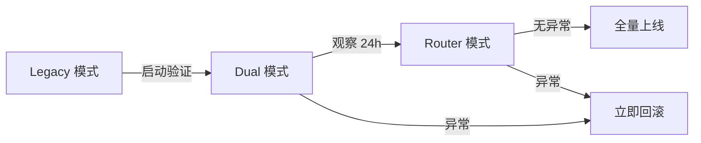

# 灰度部署与回滚 SOP

> **注意**: 本章节适用于 v2.9.1 版本，涉及路由器模式的灰度升级流程。

## 1. 路由器模式配置

### 1.1 模式说明

| 模式 | 说明 | 适用场景 | 风险等级 |
|------|------|----------|----------|
| `legacy` | 旧版直通路由 | 默认模式，稳定生产部署 | 🟢 低 |
| `dual` | 双轨模式（日志对比） | 灰度测试阶段，记录新旧路由对比 | 🟡 中 |
| `router` | 新版根路由器 | 验证通过后的全量模式 | 🟢 低 |

### 1.2 配置方式

```bash
# 临时设置（命令行）
ROUTER_MODE=legacy node scripts/start.mjs
ROUTER_MODE=dual node scripts/start.mjs
ROUTER_MODE=router node scripts/start.mjs

# 永久设置（.env 文件）
echo "ROUTER_MODE=dual" >> .env
```

### 1.3 启动日志示例

**Legacy 模式:**
```
[Config] 路由器模式：legacy
```

**Dual 模式:**
```
[Config] 路由器模式：dual
[Config] ⚠️ 双轨模式：将记录新旧路由对比日志，不改变当前行为
[Config] 📝 如需回滚到旧版路由，设置 ROUTER_MODE=legacy 并重启服务
```

**Router 模式:**
```
[Config] 路由器模式：router
```

## 2. 灰度验收流程

### 2.1 三阶段验收

遵严格的三阶段验证流程，确保回滚路径清晰可控：



**Phase 1: Legacy 验证**
- 配置：`ROUTER_MODE=legacy`
- 验证内容：基础消息流、权限流、卡片流
- 通过标准：53 个单元测试 100% 通过

**Phase 2: Dual 验证**
- 配置：`ROUTER_MODE=dual`
- 验证内容：双轨日志对比、行为一致性
- 关键日志：`type: "[Router][dual]"` 字段完整性
- 观察时间：≥ 24 小时

**Phase 3: Router 验证**
- 配置：`ROUTER_MODE=router`
- 验证内容：新路由事件分发、功能等价性
- 通过标准：与 legacy 模式行为一致

### 2.2 验证套件

**功能验证:**
- [ ] 私聊消息收发
- [ ] 群聊消息收发
- [ ] 权限卡片确认
- [ ] 提问卡片处理
- [ ] 消息撤回同步
- [ ] 会话绑定迁移

**性能验证:**
- [ ] 消息延迟 < 500ms
- [ ] 错误率 < 0.1%
- [ ] 卡片.update成功率 > 99%

**日志验证:**
- [ ] 双轨日志字段完整
- [ ] 无异常错误输出

## 3. 回滚 SOP

### 3.1 回滚触发条件

出现以下任一情况时，立即执行回滚：

| 触发条件 | 响应级别 | 说明 |
|----------|----------|------|
| 消息延迟 > 2s | P0 | 严重影响用户体验 |
| 错误率 > 5% | P0 | 系统异常率过高 |
| 权限卡/提问卡失效 | P0 | 功能严重降级 |
| 会话绑定失败率 > 10% | P1 | 影响多会话管理 |

### 3.2 回滚步骤

```bash
# 1. 停止服务
node scripts/stop.mjs

# 2. 设置回滚模式
echo "ROUTER_MODE=legacy" > .env

# 3. 重启服务
node scripts/start.mjs

# 4. 验证回滚成功
grep "路由器模式" logs/service.log
# 期望输出：[Config] 路由器模式：legacy
```

### 3.3 回滚后复测

回滚后必须验证：

- [ ] 普通消息收发正常
- [ ] 权限卡片正确显示
- [ ] 提问卡片正确处理
- [ ] 撤回操作同步
- [ ] 会话绑定功能正常

## 4. 日志诊断

### 4.1 双轨日志格式（dual 模式）

```json
{
  "type": "[Router][dual]",
  "event": "onMessage",
  "platform": "feishu",
  "conversationKey": "feishu:chat_id_xxx",
  "sessionId": "session_id_xxx",
  "routeDecision": "group",
  "chatType": "group",
  "chatId": "chat_id_xxx"
}
```

**字段说明:**
- `conversationKey`: 会话键（格式：`{platform}:{chatId}`）
- `sessionId`: OpenCode 会话 ID
- `routeDecision`: 路由决策（p2p/group/card_action/opencode_event）

### 4.2 关键日志命令

```bash
# 检查路由器模式
grep "路由器模式" logs/service.log

# 检查双轨日志（dual 模式）
grep "\[Router\]\[dual\]" logs/service.log

# 检查错误日志
tail -n 100 logs/service.err | grep -i error
```

## 5. 环境变量参考

| 变量 | 默认值 | 说明 |
|------|--------|------|
| `ROUTER_MODE` | `legacy` | 路由器模式：legacy \| dual \| router |
| `ENABLED_PLATFORMS` | * | 启用的平台列表（逗号分隔） |

**注意**: `ROUTER_MODE` 仅接受 `legacy`、`dual`、`router` 三个值，其他值将回退到 `legacy`。

## 6. 相关文档

| 文档路径 | 说明 |
|----------|------|
| `.sisyphus/evidence/task-16-rollout-gate.txt` | 三阶段验收证据 |
| `.sisyphus/evidence/task-16-fallback-recovery.txt` | 详细回滚 SOP |
| `src/config.ts` | 路由器模式配置实现 |
| `src/router/root-router.ts` | 根路由器实现 |
